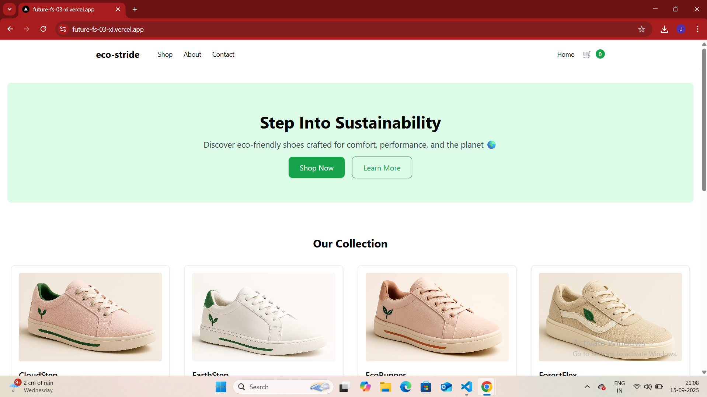
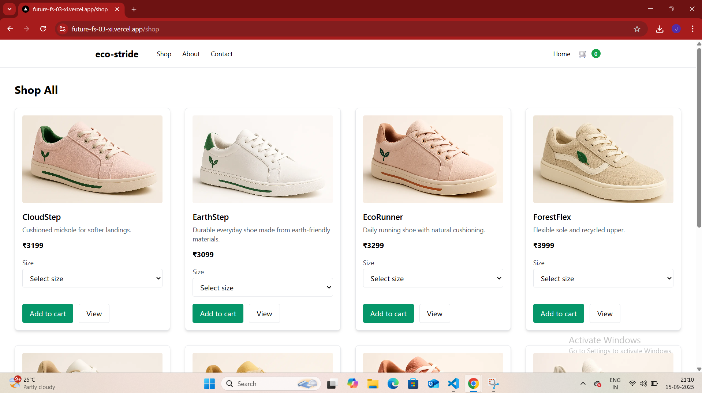
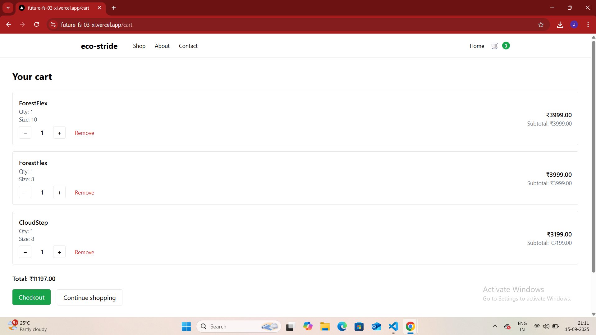

# FUTURE_FS_03 – EcoStride Website 🌱👟

A rebranded e-commerce website project built with **Next.js, React, Tailwind CSS, and Firebase Firestore**.  
This is part of my **Full Stack Web Development journey** 🚀.

---

## 🌍 Live Demo
🔗 [Click here to view the website](https://future-fs-03-xi.vercel.app)

---

## 📸 Preview

### 🏠 Home Page


### 🛍️ Shop Page


### ✅ Checkout Success


---

## ⚡ Tech Stack
- **Frontend:** Next.js 15, React, Tailwind CSS  
- **Backend:** Firebase (Firestore + Admin SDK)  
- **Deployment:** Vercel (CI/CD enabled)  

---

## 📂 Project Structure
- `src/app` → Next.js App Router pages  
- `src/components` → Reusable UI components  
- `src/data/products.js` → Product data  
- `src/lib/firebaseAdmin.js` → Firebase Admin SDK (server-side)  

---

## ✨ Features
✔️ Responsive design (mobile-first)  
✔️ Product listing with reusable ProductCard  
✔️ Cart and Checkout flow  
✔️ Order confirmation with receipt (PDF download)  
✔️ Firebase Firestore integration for order storage  
✔️ Deployed with **continuous integration (CI/CD)** on Vercel  

---

## 🔥 Firebase Integration

All order details are stored in **Cloud Firestore**.  
When a user completes checkout, their order is automatically saved in the `orders` collection.

### Example Firestore Document:
```json
{
  "name": "EcoRunner",
  "price": 3299,
  "qty": 1,
  "size": "8",
  "customer": "Muppala Jithendra Varma Raju",
  "total": 3299
}    

```
🚀 Deployment

This project is continuously deployed on Vercel.
Every push to the main branch triggers a new production deployment automatically.

🔗 Production Deployment

🤝 Contributing

Pull requests are welcome!
For major changes, please open an issue first to discuss what you’d like to change.

👩‍💻 Author

Built with ❤️ by Bhoomika Muppala