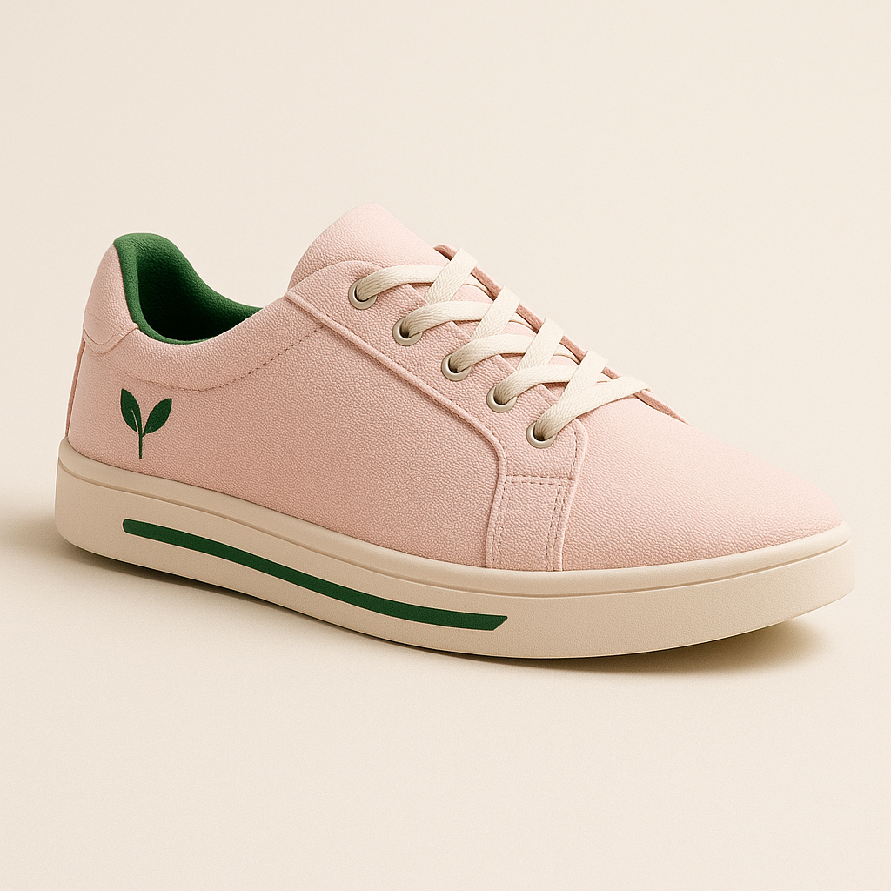

# FUTURE_FS_03 – EcoStride Website 🌱👟

A rebranded e-commerce website project built with **Next.js, React, and Tailwind CSS**.  
This is part of my **Full Stack Web Development journey** 🚀.

---

## 🌍 Live Demo
🔗 [Click here to view the website](https://future-fs-03-xi.vercel.app)

---

## 📸 Preview

---

## ⚡ Tech Stack
- Next.js 15  
- React  
- Tailwind CSS  
- Deployed on **Vercel**  

---

## 📂 Project Structure
- `src/app` → Next.js App Router pages  
- `src/components` → Reusable UI components  
- `src/data/products.js` → Product data  

---

## ✨ Features
✔️ Responsive design  
✔️ Product listing page  
✔️ Reusable Product Card component  
✔️ Deployed with continuous integration (CI/CD) on Vercel  

---

👩‍💻 Built with ❤️ by [Bhoomika Muppala](https://github.com/bhoomika-muppala)
